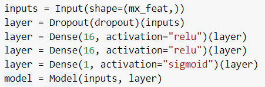
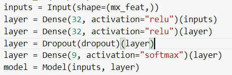
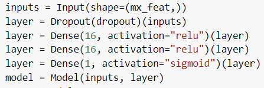

# Machine Learning
This repository save many models machine learning and code to build model that contain data cleaning, feature extraction, and modeling

# VizNewz
VizNewz is a sentiment analysis app, designed to help government/communities to get the latest trends from a specific region. Currently, we only support getting trends and sentiments from Jakarta as part of the Jakarta Smart City (JSC) program.

## Benefits
For the government:
- Get to know more about the community. VizNews helps the government to learn more about the public's responses to the government policies.
- Improve public services based on news from reputable sources.
- Help the government to base their decisions on data.

For public:
- Easily get the latest news for a specific category.
- Get to know more about the latest government policies and their acceptance in the community based on the results of sentiment analysis.

## Models
Link Google Colab :  
https://colab.research.google.com/drive/1Svvs_OYL1qA0j1MsFoob7KghqhQhL3Bh  
https://colab.research.google.com/drive/1cyL6KIS-padWpcSmpQMvFFHmZCBAR7Qt#scrollTo=WiJ9zzQJ3w4N  
https://colab.research.google.com/drive/1FvM8iRStqAvjLdwz93l2TuHrMqDNwBsG?usp=sharing  

- [Sentiment Analysis](https://github.com/marsathoriq/Klasifikasi-Berita/blob/main/Sentiment%20Analysis%20Model/Sentiment_Analysis.ipynb)
    
- [Topic Classification](https://github.com/marsathoriq/Klasifikasi-Berita/blob/main/Topic%20Classification%20Model/Topic_Classification.ipynb)
    
- [Jakarta News Detection](https://github.com/marsathoriq/Klasifikasi-Berita/blob/main/Jakarta%20News%20Detection%20Model/Jakarta_News_Detection.ipynb)
    

## Pipeline
- Data Cleaning  
For data cleaning we using method like Normalization, stopword removal, delete punctuation, lowercase, and delete whitespace
- Feature Extraction  
For feature extraction we using bag of word (BOW) and compare with word2vector. But for final model we use BOW
- Modeling  
In modeling we compare two deep learning model first is neural network and second is Long short-term memory (LSTM)

## Result 
This is accuracy comparing BOW + NN vs W2V + LSTM

|                        | BOW + NN | W2V + LSTM |
|------------------------|----------|------------|
| Jakarta News Detection |   78.2%  |    67.7%   |
| Topic Modeling         |   80.6%  |    68.5%   |
| Sentiment Analysis     |   80.9%  |    71.9%   |
